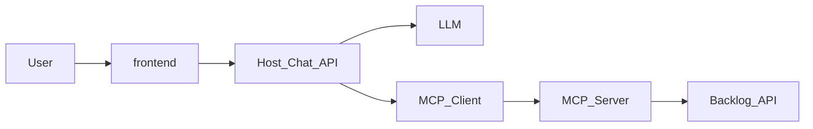
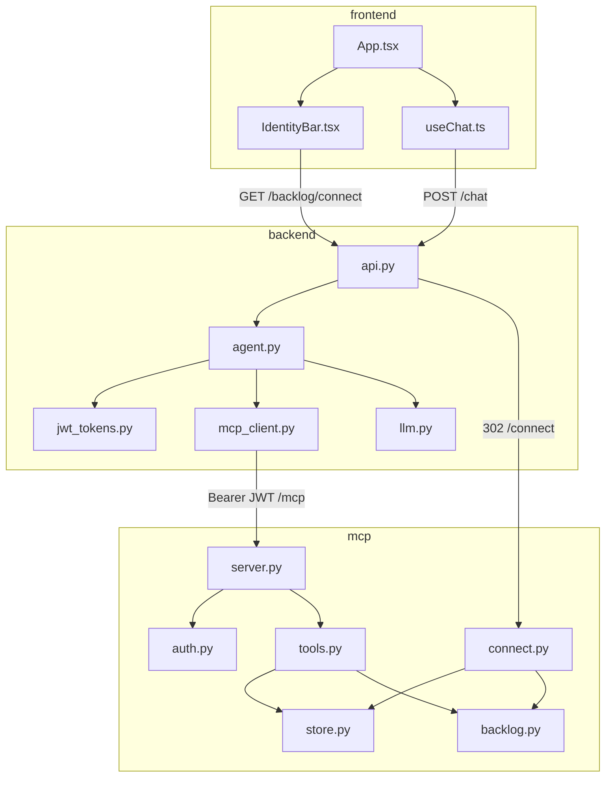
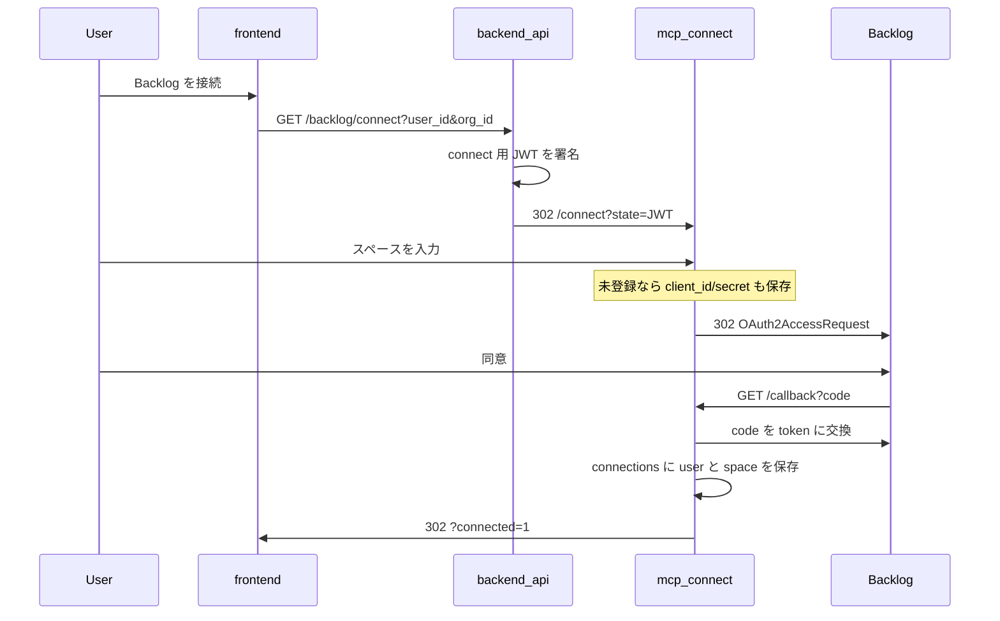
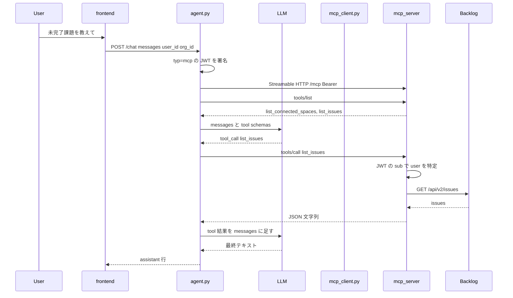

# v3: 自作 Backlog MCP

v1 は公式の Backlog MCP を **外から使う** 教材だった。v3 は同じ Chat から、**MCP サーバー側を自分たちで書く** 教材である。

目的は Backlog 製品を完成させることではない。次の問いに、コードで答えられるようにすることである。

- MCP の Host / Client / Server は、どのプロセスのどのファイルか
- LLM は Backlog API を直接呼ばない。なぜ tool を経由するのか
- 「接続」と「チャット」は、なぜ別の流れなのか
- 1 つの MCP が複数ユーザー・複数スペースを持つとき、トークンはどこに置くのか

---

## MCP を三つの役割で見る

[Model Context Protocol (MCP)](https://modelcontextprotocol.io/) は、LLM アプリが外部ツールを呼ぶときの約束事である。HTTP の「クライアントとサーバー」に加え、**Host** という第三の役割がある。

| 役割 | このリポジトリでの実体 | 仕事 |
|---|---|---|
| **Host** | `backend/`（Chat API） | ユーザー発話を受け、LLM と MCP Client を回す。tool をいつ呼ぶかは LLM が決める |
| **Client** | `backend` 内の MCP SDK | Host の一部。MCP Server に `tools/list` と `tools/call` を送る |
| **Server** | `mcp/` | tool の定義と実行。ここでは Backlog の課題一覧 |

関係は次のとおりである。矢印の向きが「誰が誰を呼ぶか」である。



押さえる点は三つある。

1. **LLM は MCP を知らない。** Host が tool schema を OpenAI 形式に直し、LLM に渡す。
2. **LLM は Backlog を知らない。** 「課題を取れ」と tool 名を返すだけである。実行するのは Server。
3. **Server は会話を持たない。** チャットの履歴は Host（と検証 UI）側にある。

v1 では Server が公式コンテナだった。v3 では `mcp/` がその位置を占める。Host の loop の形は v1 と同じである。

---

## v3 が公式 MCP と違うところ

公式 Backlog MCP の OAuth は、**1 サーバー = 1 組織** である。複数スペースを API キーで載せる機能はあるが、OAuth とは両立しない。

v3 の Server は次を同時に持つ。

- Chat のテナント（`org_id`）は Host が知る。ユーザーと org は 1:1
- Backlog のスペースは Server だけが知る。1 ユーザーが複数スペースを接続できる
- 接続はチャットの外のボタンで明示的に行う。tool 結果から OAuth URL は出さない

Cursor からこの MCP につなぐ想定はない。クライアントは自前の Chat Host だけである。

---

## プロセスとディレクトリ

```text
v3/
  compose.yaml     mcp と api を常駐させる
  mcp/             MCP Server（接続 UI + OAuth + tools）
  backend/         MCP Host（Chat API + tool loop）
  frontend/        検証 UI（身元入力 + 接続ボタン + チャット）
```

Compose 上のポートは次である。

| プロセス | ポート | 主なパス |
|---|---|---|
| MCP Server | 3333 | `/mcp`（tool）、`/connect`（接続）、`/callback`（OAuth） |
| Chat Host | 8003 | `/chat`、`/backlog/connect`、`/health` |
| 検証 UI | 5173 | ブラウザ。Compose には載せない |

`/mcp` は Streamable HTTP である。Host が MCP を子プロセス（stdio）で都度起動しない。v1 と同じ判断である。

---

## コードの地図

読む順番は、役割の境界から中へ入るとよい。



| ファイル | 役割 |
|---|---|
| [frontend/src/components/IdentityBar.tsx](frontend/src/components/IdentityBar.tsx) | 「Backlog を接続」リンク。チャット API は呼ばない |
| [backend/src/chat/api.py](backend/src/chat/api.py) | HTTP の入口。接続は 302、チャットは JSON |
| [backend/src/chat/agent.py](backend/src/chat/agent.py) | LLM ↔ tool loop。MCP セッションを開く |
| [backend/src/chat/mcp_client.py](backend/src/chat/mcp_client.py) | `list_tools` / `call_tool` を OpenAI 形式に合わせる |
| [mcp/src/backlog_mcp/server.py](mcp/src/backlog_mcp/server.py) | tool 登録と `/mcp` の起動 |
| [mcp/src/backlog_mcp/connect.py](mcp/src/backlog_mcp/connect.py) | スペース入力と Backlog OAuth |
| [mcp/src/backlog_mcp/store.py](mcp/src/backlog_mcp/store.py) | スペースの OAuth アプリと `(user, space) → token` |
| [mcp/src/backlog_mcp/tools.py](mcp/src/backlog_mcp/tools.py) | 接続済みスペースの解決と課題一覧 |

Host はスペース名も Backlog トークンも持たない。知っているのは `user_id` と `org_id` だけである。

---

## 流れ 1: 明示接続（チャットの外）

OAuth は「課題を教えて」の途中では始まらない。ユーザーが接続ボタンを押したときだけ始まる。



ここで JWT は **MCP の tool 用ではない。** Host が「このブラウザ操作は user X / org Y のものだ」と MCP に伝えるための、短い `typ=connect` トークンである。

MCP が覚える表は二つある。どちらもメモリであり、再起動で消える。

1. `space_apps` — その Backlog スペースの OAuth アプリ（スペースにつき一度）
2. `connections` — `(user_id, domain) → Backlog access token`（ユーザーとスペースの組）

2 本目のスペースも、同じボタンから同じ `/connect` に入る。チャットの tool には `connect` を置いていない。

---

## 流れ 2: チャットと tool loop

接続が済んだあと、「未完了課題を教えて」は次の loop になる。v1 の Host と同じ形である。



loop の不変条件は [backend/src/chat/agent.py](backend/src/chat/agent.py) の `run_tool_loop` にある。

- LLM が返した assistant 行は、tool を実行する **前に** messages へ足す
- tool 行の `tool_call_id` は、対応する `assistant.tool_calls[i].id` と一致する
- tool_calls が無ければ終了する

MCP の tool は二つだけである。

| tool | すること |
|---|---|
| `list_connected_spaces` | そのユーザーが OAuth したスペースを返す |
| `list_issues` | 指定スペースの課題を返す。未接続なら「接続ボタンから」と返す（URL は付けない） |

`list_issues` の `space` は、Chat の org ではない。そのユーザーが接続済みの Backlog ドメインである。接続が 1 本なら省略できる。2 本以上なら必須である。他人のスペースは拒否する。

---

## 認証が二重になっている理由

初学者が混同しやすいので、層を分ける。

```text
ブラウザ  --connect JWT-->  MCP /connect   --Backlog OAuth-->  そのスペースの token
Host     --mcp JWT------>  MCP /mcp       --保存済み token-->  Backlog API
```

- **connect JWT**: 接続ボタン用。Host が署名し、MCP の HTML 画面が検証する
- **mcp JWT**: tool 呼び出し用。Host が毎チャット署名し、`/mcp` が検証する。`sub` がユーザー
- **Backlog token**: ユーザーが同意したあとの API トークン。MCP の `connections` にだけある

Host と MCP は同じ `MCP_JWT_SECRET` を持つ。これは自前 Host だけがクライアントだからである。Cursor 向けの Dynamic Client Registration は実装していない。

---

## 起動

秘密情報はリポジトリ直下の `.envrc` を direnv で読む。`OPENCODE_GO_API_KEY` が Host の LLM に必要である。

```bash
cd v3 && docker compose up
cd v3/frontend && pnpm install && pnpm dev
```

1. ブラウザで検証 UI を開く（既定は `http://localhost:5173`）
2. `user_id` と `org_id` を入れる（デモ用。本格ログインではない）
3. 「Backlog を接続」からスペースを追加する
4. 「未完了課題を教えて」と送る

テストは Live Backlog を叩かない。

```bash
cd v3/mcp && uv run pytest
cd v3/backend && uv run pytest
```

---

## 次に読むとよい順

1. [backend/src/chat/agent.py](backend/src/chat/agent.py) — Host の loop。MCP を知らなくても「LLM が tool を要求する」形が見える
2. [backend/src/chat/mcp_client.py](backend/src/chat/mcp_client.py) — MCP の tool schema を LLM 向けに変換する薄い層
3. [mcp/src/backlog_mcp/server.py](mcp/src/backlog_mcp/server.py) — Server が tool を登録する場所
4. [mcp/src/backlog_mcp/tools.py](mcp/src/backlog_mcp/tools.py) — JWT のユーザーからスペースを解決する
5. [mcp/src/backlog_mcp/connect.py](mcp/src/backlog_mcp/connect.py) — チャットと切り離した OAuth

リポジトリ全体の地図は [docs/guide/index.html](../docs/guide/index.html) にある。v1 の Host を先に読むと、v3 で増えたのが Server 側だと対比しやすい。
