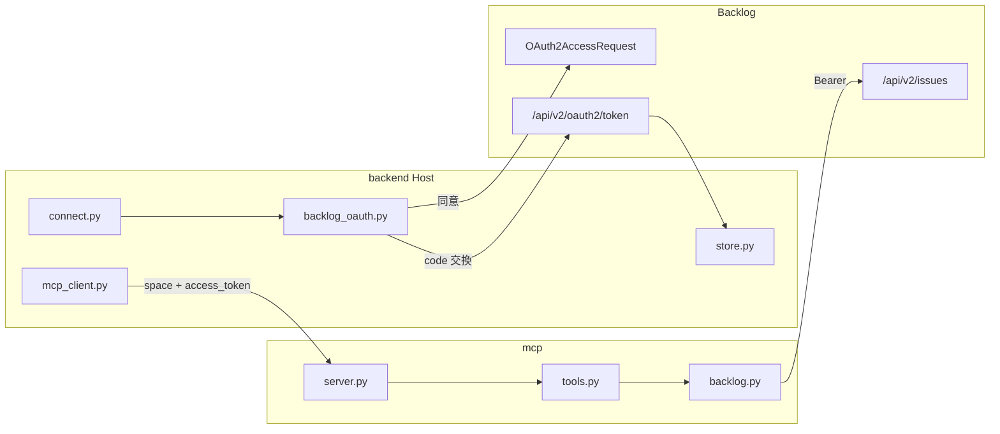

# backlog-mcp

Chat API 向けの自作 Backlog MCP **Server**。Host は `v3/backend`。

接続と token は Host が持つ。MCP は渡された `space` と `access_token` で `list_issues` する。
`/mcp` に認証は無い。Compose ではホストに port を出さず、api からだけ届く。

## コードの地図

OAuth は Host が Backlog とやる。MCP は渡された token で API を叩くだけである。

| 相手 | 実体 | すること |
|---|---|---|
| Host OAuth | `connect.py` / `backlog_oauth.py` | スペースの同意画面へ送り、code を token に換えて `store` へ置く |
| Backlog OAuth | `{space}/OAuth2AccessRequest.action` と `{space}/api/v2/oauth2/token` | ユーザー同意と token 発行。MCP は触らない |
| Backlog API | `{space}/api/v2/issues` | `backlog.py` が Host から渡された token で叩く |

## 入口

| パス | 誰が呼ぶか | 認証 |
|---|---|---|
| `/mcp` | Host の MCP Client | なし。内部ネットワークのみ |
| `/health` | Compose | なし |

## ファイル（読む順）

| ファイル | 役割 |
|---|---|
| `server.py` | 配線。tool 登録と起動 |
| `tools.py` | 渡された space と token で課題一覧 |
| `backlog.py` | Backlog REST |
| `settings.py` | bind と件数上限 |

MCP は接続を持たない。token は Host が tool 引数で渡す。
