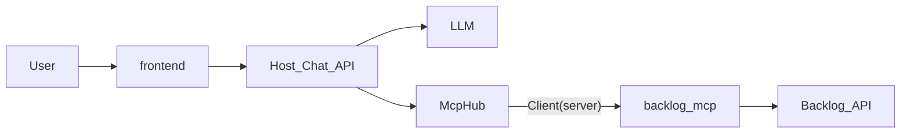

# v4: 同一プロセスの Backlog MCP

v3 は自作 MCP を **別プロセスの Streamable HTTP** として動かした。v4 は同じ Server を、Host と **同一プロセスのモジュール** にする。口は MCP の高水準 `Client` のままである。

目的は次の問いに、コードで答えられるようにすることである。

- Host / Client / Server は、どのプロセスのどのファイルか
- `Client(server)` と `Client(url)` は、Host から見て何が同じか
- なぜ HTTP の `/mcp` をやめたか
- 1 ユーザー 1 スペースは、MCP の tool 引数ではなく Host の約束である理由

---

## MCP を三つの役割で見る

| 役割 | このリポジトリでの実体 | 仕事 |
|---|---|---|
| **Host** | `backend/`（Chat API） | ユーザー発話を受け、LLM と `McpHub` を回す |
| **Client** | `mcp.Client`（Host の一部） | in-process なら `Client(server)`、外部なら `Client(url)` |
| **Server** | `backend/modules/backlog-mcp` | tool の定義と実行。ここでは Backlog の課題一覧 |



---

## プロセスとディレクトリ

```text
v4/
  compose.yaml     api だけを常駐させる
  backend/         MCP Host + modules/backlog-mcp
  frontend/        検証 UI
```

| プロセス | ポート | 主なパス |
|---|---|---|
| Chat Host（MCP も同じプロセス） | 8004 | `/chat`、`/backlog/connect`、`/backlog/callback`、`/health` |
| 検証 UI | 5174 | ブラウザ。Compose には載せない |

自作 MCP に `/mcp` は無い。Host 以外からは届かない。

---

## コードの地図

| ファイル | 役割 |
|---|---|
| [backend/src/chat/mcp_hub.py](backend/src/chat/mcp_hub.py) | 複数 MCP を `Client` で開き、`{id}_{name}` で prefix する |
| [backend/src/chat/agent.py](backend/src/chat/agent.py) | LLM ↔ tool loop。Hub を開く |
| [backend/modules/backlog-mcp/src/backlog_mcp/server.py](backend/modules/backlog-mcp/src/backlog_mcp/server.py) | `create_server`。HTTP では待受けない |
| [backend/src/chat/store.py](backend/src/chat/store.py) | `user_id` → 1 本の接続。2 本目は上書き |
| [backend/src/chat/connect.py](backend/src/chat/connect.py) | チャット外の OAuth |

LLM から見える tool は `backlog_list_issues` である。`space` と `access_token` は schema に出ない。Host が唯一の接続から注入する。

Settings の `MCP_SERVERS` は JSON 配列である。既定は `[{"id":"backlog","kind":"inprocess"}]`。外部 MCP は `{"id":"docs","kind":"http","url":"https://..."}` を足す。

---

## token は Host が持つ

```text
ブラウザ  --フォーム-->  Host /backlog/connect  --Backlog OAuth-->  connections に refresh
Host     --chat開始に refresh して得た access-->  Client(server)  --渡された access-->  Backlog API
```

1 ユーザーは 1 スペース。同じボタンから再接続すると上書きする。切断 API は無い。

---

## 起動

秘密情報はリポジトリ直下の `.envrc` を direnv で読む。Host には `OPENCODE_GO_API_KEY`、`BACKLOG_CLIENT_ID`、`BACKLOG_CLIENT_SECRET` が必要である。Backlog アプリの Redirect URI に `http://localhost:8004/backlog/callback` を足すこと。

```bash
cd v4 && docker compose up
cd v4/frontend && pnpm install && pnpm dev
```

1. ブラウザで検証 UI を開く（既定は `http://localhost:5174`）
2. `user_id` と `org_id` を入れる
3. 「Backlog を接続」からスペースを接続する
4. 「未完了課題を教えて」と送る

テストは Live Backlog を叩かない。

```bash
cd v4/backend && uv run pytest
```

手順は [docs/guide/v4.html](../docs/guide/v4.html) にある。
